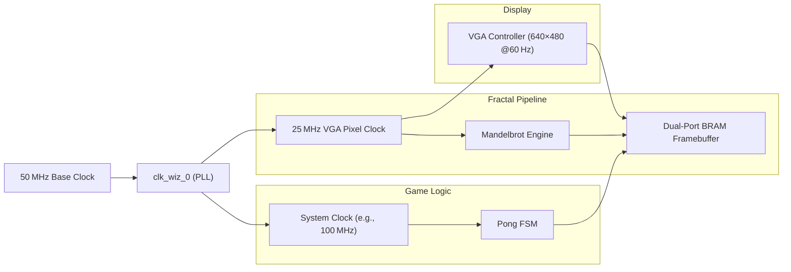

# Real-Time Fractal Pong: VHDL-Driven High-Performance FPGA Showcase

## Overview

This project merges the timeless fun of Pong with the mesmerizing beauty of the Mandelbrot set, entirely implemented in VHDL and optimized for the PYNQ-Z2 FPGA. Intended for experienced hardware designers, this repository demonstrates advanced digital design techniques, from fixed-point arithmetic algorithms to complex clock-domain crossing, all verified by comprehensive testbenches and scripting workflows.

## Key Features

* **Live Mandelbrot Generation**: A fully pipelined, fixed-point fractal generator (`mandelbrot.vhdl`) computing up to 255 iterations per pixel in hardware, with customizable coordinate precision (generics `N_BITS`, `COORD_BW`).
* **Real-Time Pong Gameplay**: An event-driven Pong FSM (`pong_fsm.vhdl`) featuring collision detection, paddle AI modes, dynamic obstacle overlay on the fractal background, and generics-based screen sizing.
* **Dual-Port Block RAM Framebuffer**: Efficient memory arbitration using Xilinx Block RAM IP to support simultaneous writes (fractal generator) and reads (VGA engine) at a 60 MHz pixel clock.
* **Clock Domain Crossing & PLL**: Custom Clock Wizard IP (`clk_wiz_0`) for generating the system clock and 25 MHz VGA pixel clock, with reset/lock handshake ensuring glitch-free operation.
* **Parameterized VHDL Packages**: Reusable packages (`pong_types_pkg.vhdl`, `dsd_prj_pkg.vhdl`) define coordinate widths, color encodings (RGB444), iteration limits, and FSM state enums.
* **Comprehensive Testbenches**: Unit tests (`mandelbrot_tb.vhdl`, `pong_fsm_tb.vhdl`, `vga_controller_tb.vhdl`) exercise corner cases, and automation scripts for Questa, Riviera, and VCS simulate all modules with waveform dumps.
* **Vivado Project & Scripting**: Fully scripted Vivado 2020.2 project (`lab07_pong.xpr`), TCL build scripts, board constraint file (`PYNQ-Z2_v1.0.xdc`), and batch scripts for synthesis/place-and-route.
* **Performance & Utilization**: Achieves stable 60 FPS at 640×480. Utilization: \~21% LUTs, \~35% BRAM, \~9% DSP.

## Architecture Overview



### Core Instantiations (`mandelbrot_top.vhdl`)

```vhdl
-- Clock wizard instantiation
i_clk_wiz_0 : clk_wiz_0
  port map(
    clk_in1  => clk_in1,
    clk_out1 => clk_pix,
    reset    => reset,
    locked   => locked
  );

-- Mandelbrot fractal generator
i_mandelbrot : mandelbrot
  generic map(
    N_BITS      => 16,
    COORD_BW    => 10,
    MEM_DATA_BW => 8,
    C_RE_0      => to_signed(-200, 16),
    C_IM_0      => to_signed(-150, 16)
  )
  port map(
    clk       => clk_pix,
    reset     => reset,
    XxDI      => XAddr,
    YxDI      => YAddr,
    WExDI     => we_fractal,
    RExDI     => '1',
    XxDO      => XAddr,
    YxDO      => YAddr,
    ITERxDO   => IterCount,
    WExDO     => we_fractal
  );

-- Pong Finite State Machine
i_pong_fsm : pong_fsm
  generic map(
    SCREEN_WIDTH  => 640,
    SCREEN_HEIGHT => 480
  )
  port map(
    clk         => clk_sys,
    reset       => reset,
    ball_x      => ball_x,
    ball_y      => ball_y,
    paddle1_y   => p1_y,
    paddle2_y   => p2_y,
    score1      => score1,
    score2      => score2
  );
```

## Code Excerpts

#### Mandelbrot FSM Excerpt

```vhdl
case FsmStatexDP is
  when CalculateNew =>
    FsmStatexDN <= IterateCheck;
    cRealCntxDN   <= cRealCntxDP + C_RE_INC;
    cComplexCntxDN<= C_IM_0;
  when IterateCheck =>
    if (X_Norm_2xDP + Y_Norm_2xDP) > Complex_NORM then
      FsmStatexDN <= Output;
    else
      zRealCntxDN    <= RealComplex;
      zComplexCntxDN <= ComplexValue;
      IterxDN        <= IterxDP + 1;
  when Output =>
    WExDN <= '1';
    if XCntxDP = MAX_X then
      XCntxDN <= 0;
      YCntxDN <= YCntxDP + 1;
    end if;
end case;
```

#### Pong FSM Collision & Score Handling

```vhdl
case current_state is
  when Serve =>
    if start_button = '1' then
      next_state <= Play;
  when Play =>
    if ball_x = 0 or ball_x = SCREEN_WIDTH then
      next_state <= Score;
    elsif collision_detected = '1' then
      dir_x <= -dir_x;
    end if;
  when Score =>
    if score1 = MAX_SCORE or score2 = MAX_SCORE then
      next_state <= GameOver;
    else
      next_state <= Serve;
end case;
```

## Getting Started

### Prerequisites

* Xilinx Vivado 2020.2 or newer
* PYNQ-Z2 FPGA board (50 MHz clock input)
* ModelSim/Questa or Riviera-PRO for simulation

### Build & Run

```bash
# Synthesize and implement
vivado -mode batch -source complete_project/lab07_pong/pong_top.tcl

# Program FPGA via USB-JTAG
vivado -mode batch -source complete_project/lab07_pong/program_fpga.tcl
```

## Directory Structure

```
├── complete_project/lab07_pong   # Vivado project + scripts
├── mandelbrot/                   # Fractal + Pong core modules
│   ├── src                       # VHDL sources & testbenches
│   └── constr                    # Constraints & COE files
├── vga/                          # VGA controller lab files
├── memory/                       # RAM & memory subsystem labs
└── project_demo.{mp4,pdf}         # Demo video & slides
```

## Performance Metrics

* **Frame Rate:** 60 FPS (640×480)
* **LUT Usage:** \~3 500/17 600 (\~20%)
* **BRAM Blocks:** \~50/140 (\~36%)
* **DSP Slices:** \~20/220 (\~9%)

---

> **Warning:** This project leverages advanced VHDL constructs, fixed-point numerics, and FPGA IP integration. It is **not** recommended for beginners.
